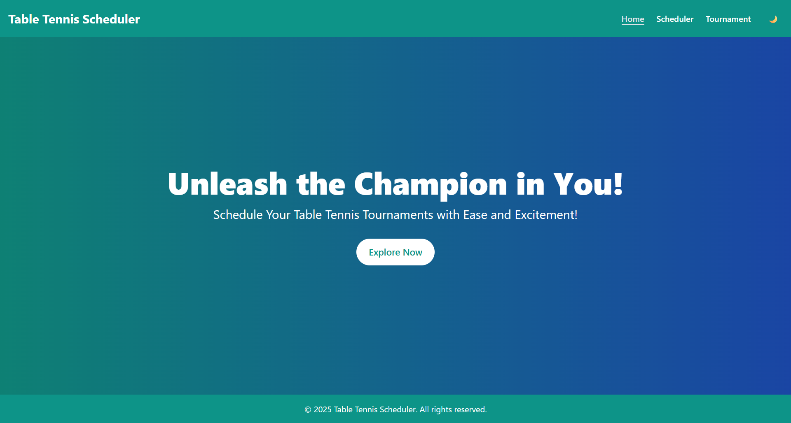
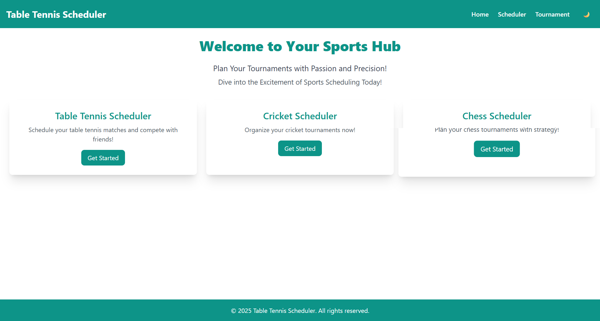
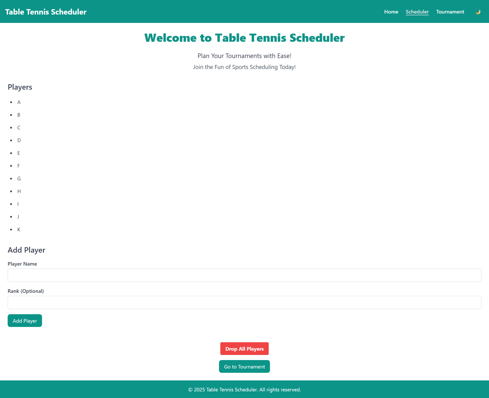
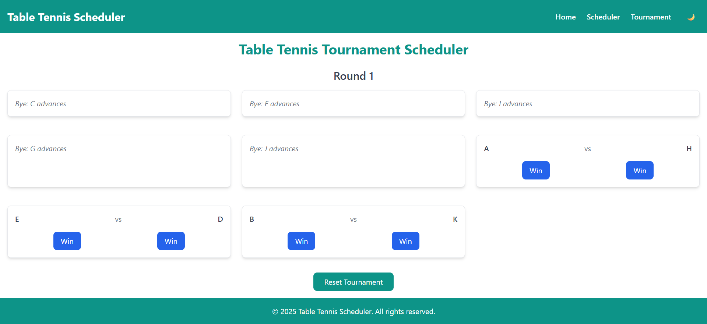
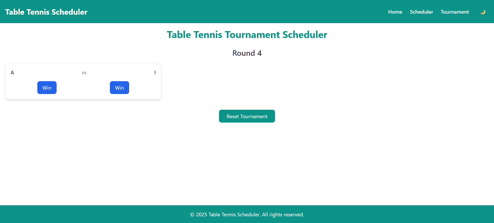
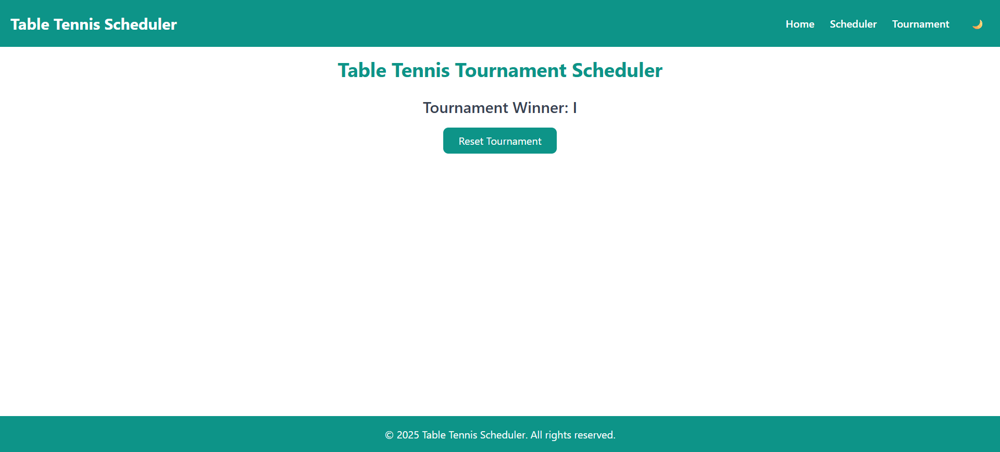

# project_V1.2

# 🏓 Table Tennis Match Scheduler

A MERN stack-based project to automatically schedule knockout-style table tennis matches for sports events, resolving real-world issues of manual scheduling and absent participants.

This project helps organizers:

- Auto-pair available players
- Handle BYE calculations intelligently
- Progress winners through each round

## 📸 Screenshots

### 🏠 Home Page


### 🏟️ Sports Hub


### 🧑‍🤝‍🧑 Player List


### ⚔️ First Round Matches


### 🏁 Final Round


### 🥇 Tournament Winner



## 🚀 Features

- 👥 Auto-pair players based on live data from the database
- 🕳️ Structured BYE logic based on real-world seeding rules
- 🧠 Winner progresses automatically after clicking “Win”
- ⏭️ Next round unlocks only after all current matches are completed
- 🏆 Final winner calculated after multiple knockout rounds


## 🛠️ Tech Stack

### Frontend:
- ReactJS
- Tailwind CSS
- React Router
- Vite

### Backend:
- Node.js
- Express.js
- MongoDB (via Mongoose)

### Deployment:
- Render (for both frontend & backend)


## 📁 Folder Structure

### Client (Frontend)

```
client/
├── public/
├── src/
│   ├── assets/
│   ├── components/
│   │   ├── AddPlayerForm.jsx
│   │   ├── DropAllPlayerButton.jsx
│   │   ├── Footer.jsx
│   │   ├── Header.jsx
│   │   ├── HomeComponent.jsx
│   │   ├── LoadingSpinner.jsx
│   │   ├── MatchCard.jsx
│   │   └── PlayerList.jsx
│   ├── pages/
│   │   ├── ChessScheduler.jsx
│   │   ├── CricketScheduler.jsx
│   │   ├── Scheduler.jsx
│   │   ├── SportsHub.jsx
│   │   ├── TableTennisScheduler.jsx
│   │   └── Tournament.jsx
│   ├── App.jsx
│   ├── main.jsx
│   └── index.css
├── tailwind.config.js
├── postcss.config.js
├── vite.config.js
└── package.json
```

### Server (Backend)

```
server/
├── config/
│   └── db.js
├── controllers/
│   ├── matchController.js
│   └── playerController.js
├── models/
│   ├── Match.js
│   ├── Player.js
│   └── ShuffledPlayer.js
├── routes/
│   ├── matchRoutes.js
│   ├── playerRoutes.js
│   └── tournamentRoutes.js
├── index.js
└── package.json
```


## 🚀 How to Run Locally


> Make sure you have **Node.js** and **MongoDB** installed.

### 1. Clone the Repository

```bash
git clone https://github.com/Takshil-P/tt-scheduler.git
cd tt-scheduler
```

### 2. Start the Server

```bash
cd server
npm install
npm start
```

> Server will run on `http://localhost:5000`

### 3. Start the Client

In a **new terminal**:

```bash
cd client
npm install
npm run dev
```

> Frontend will run on `http://localhost:5173`


## 🌐 Live Demo

🔗 [Try the Live App](https://tt-scheduler-frontend.onrender.com)

> Full working prototype with actual knockout logic, dynamic pairing, and match progression.
> *Note: This uses a shared database. Please avoid testing with sensitive or real data.*


## 🧩 Problem Statement & Inspiration

During my college sports day, match schedules were handwritten a day before for 20–30 students per game. But on the event day, only a few players showed up, making the entire bracket invalid and confusing to reorganize.

This inspired me to build a system that:

- Automatically schedules players **based on who actually shows up**
- Uses standard **knockout + BYE** logic for fair pairing
- Handles round progression dynamically


## 📚 Learning Outcomes

- Understood the full development cycle of a MERN stack project — from designing the schema to deploying on Render.
- Learned how to manage state and conditional rendering effectively in React.
- Improved backend logic structuring with Express routes and MongoDB queries.
- Built logic for real-world scheduling (like structured BYE distribution and match progression).
- Gained confidence in solo project management — designing, building, and debugging independently.


## 👤 Author

**Takshil Panchal**  
Final Year Computer Engineering Student  
🔗 [LinkedIn](https://www.linkedin.com/in/takshil-panchal-99b952281) 
• 📧 taksh.panchal05@gmail.com


## 📄 License

This project is open-source for learning and demonstration purposes only.  
Please do not use or distribute the code without permission.
